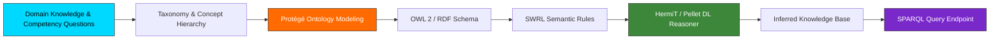

# Architecture Overview — ENIAD Semantic Web & Knowledge Ontologies

```mermaid
graph LR
    A[Domain Knowledge & Competency Questions] --> B[Taxonomy & Concept Hierarchy]
    B --> C[Protégé Ontology Modeling]
    C --> D[OWL 2 / RDF Schema]
    D --> E[SWRL Semantic Rules]
    E --> F[HermiT / Pellet DL Reasoner]
    F --> G[Inferred Knowledge Base]
    G --> H[SPARQL Query Endpoint]
    style A fill:#00D9FF,stroke:#333,stroke-width:1px,color:#000
    style C fill:#FF6B00,stroke:#333,stroke-width:1px,color:#fff
    style F fill:#3C873A,stroke:#333,stroke-width:1px,color:#fff
    style H fill:#7928CA,stroke:#333,stroke-width:1px,color:#fff

```
