# Welcome to the ENIAD Semantic Web & Knowledge Ontologies Documentation Wiki 📖

Welcome to the official technical documentation and engineering reference for **ENIAD Semantic Web & Knowledge Ontologies**.

---

## 🎯 Academic & Technical Mission

Knowledge Engineering and Semantic Web Architecture with Protégé, OWL 2, RDF Schema, SWRL Rules, Pellet/HermiT Reasoners, and SPARQL Query Processing.

Developed within the **State Engineering Degree in Artificial Intelligence & Digital Systems** at the **École Nationale d'Intelligence Artificielle et du Digital (ENIAD)**, Berkane, Morocco.

---

## 📚 Wiki Documentation Chapters

| Chapter | Description | Primary Topics |
| :--- | :--- | :--- |
| **[[Architecture]]** | Deep architectural design & component topology | Mermaid diagrams, component interactions, runtime environment |
| **[[Getting-Started]]** | Developer setup & workstation configuration | Prerequisites, toolchain setup, execution commands |
| **[[Curriculum-Guide]]** | Detailed syllabus and laboratory breakdown | Lab objectives, expected outputs, deliverables |

---

## 🏛️ System Architecture Snapshot

```mermaid
graph LR
    A[Domain Knowledge & Competency Questions] --> B[Taxonomy & Concept Hierarchy]
    B --> C[Protégé Ontology Modeling]
    C --> D[OWL 2 / RDF Schema]
    D --> E[SWRL Semantic Rules]
    E --> F[HermiT / Pellet DL Reasoner]
    F --> G[Inferred Knowledge Base]
    G --> H[SPARQL Query Endpoint]
    style A fill:#00D9FF,stroke:#333,stroke-width:1px,color:#000
    style C fill:#FF6B00,stroke:#333,stroke-width:1px,color:#fff
    style F fill:#3C873A,stroke:#333,stroke-width:1px,color:#fff
    style H fill:#7928CA,stroke:#333,stroke-width:1px,color:#fff

```

---

## 📚 Ontology Engineering Life Cycle

1. **Competency Questions Definition**: Formulating user queries that the knowledge model must answer.
2. **Class & Property Hierarchy authoring**: Designing taxonomic subsumption (`rdfs:subClassOf`) and property domains/ranges.
3. **Formal Axiomatization**: Disjoint classes, inverse properties, functional and transitive characteristics.
4. **Automated Reasoning & Consistency Checking**: Invoking HermiT and Pellet reasoners to infer implicit relationships and detect contradictory assertions.
5. **SPARQL Endpoint Execution**: Executing pattern-matching graph queries over the ontology repository.

---

*Maintained with ❤️ by [Oussama EL HADJI](https://github.com/Bosaj) • ENIAD Berkane*
